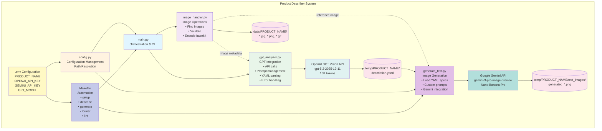
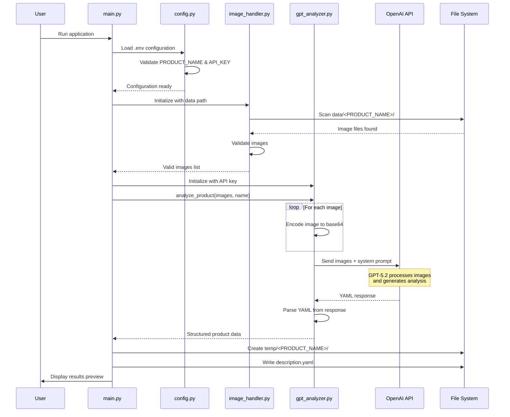

# Architecture Documentation

## System Overview

Product Describer is a modular Python application that analyzes product images using GPT vision capabilities and generates structured YAML descriptions.

## Architecture Diagram



## Component Architecture

### 1. Entry Point: `main.py`
**Responsibility**: Application orchestration and user interface

- Loads configuration
- Validates environment setup
- Coordinates between modules
- Handles errors and user feedback
- Displays results

### 2. Configuration: `config.py`
**Responsibility**: Centralized configuration management

**Key Functions**:
- `__init__()`: Load environment variables
- `validate()`: Ensure required config is present
- `get_product_data_dir()`: Return path to product images
- `get_product_output_dir()`: Return path to output directory
- `get_output_file_path()`: Return full path to output YAML

**Environment Variables**:
- `PRODUCT_NAME` (required): Product identifier
- `OPENAI_API_KEY` (required): OpenAI authentication
- `GEMINI_API_KEY` (optional): Google Gemini authentication for image generation
- `GPT_MODEL` (optional): Model version (default: gpt-5.2-2025-12-11)
- `GENERATION_PROMPT` (optional): Custom prompt for image generation
- `IMAGE_ASPECT_RATIO` (optional): Output aspect ratio (default: 1:1)
- `IMAGE_RESOLUTION` (optional): Output resolution (default: 2K)

### 3. Image Processing: `image_handler.py`
**Responsibility**: Image file operations and validation

**Key Functions**:
- `get_image_files()`: Discover all supported images
- `encode_image_to_base64()`: Encode images for API transmission
- `get_image_info()`: Extract metadata (size, format, etc.)
- `validate_images()`: Check image integrity

**Supported Formats**: JPG, JPEG, PNG, GIF, WEBP

### 4. GPT Integration: `gpt_analyzer.py`
**Responsibility**: Communication with OpenAI GPT API

**Key Functions**:
- `analyze_product()`: Main analysis orchestration
- `_encode_image()`: Image encoding helper
- `_get_image_mime_type()`: Determine content type
- `_extract_yaml_from_response()`: Parse GPT response

**API Configuration**:
- Model: Configurable (default: gpt-5.2-2025-12-11)
- Max Completion Tokens: 16000 (increased for GPT-5.2 reasoning model)
- Temperature: 0.3 (lower for technical precision)
- Image Detail: High

**Error Handling**:
- Empty response detection with detailed logging
- YAML parsing validation
- Response preview for debugging
- Comprehensive error messages with troubleshooting context

### 5. Image Generation: `generate_test.py`
**Responsibility**: Generate product images using Nano Banana Pro (Google Gemini)

**Key Functions**:
- `load_yaml_specs()`: Load technical specifications from YAML
- `generate_image_from_specs()`: Generate image via Gemini API
- `main()`: Orchestrate generation workflow

**API Configuration**:
- Model: gemini-3-pro-image-preview
- Aspect Ratio: Configurable (default: 1:1)
- Resolution: Configurable (default: 2K)
- Prompt customization: File, environment variable, or default

**Prompt Structure**:
- YAML specifications embedded in prompt
- Emphasis on exact measurements and colors
- Custom instructions (e.g., background, styling)
- Strict adherence to technical specs

### 6. Build Automation: `Makefile`
**Responsibility**: Simplify common development and operational tasks

**Targets**:
- `make setup`: Complete project initialization
- `make describe`: Run product analysis
- `make generate`: Generate images (with optional PROMPT parameter)
- `make format`: Format code with Black
- `make lint`: Run linters (flake8, mypy)
- `make clean`: Remove caches and temporary files
- `make workflow`: Complete analysis + generation pipeline

**System Prompt**: Instructs GPT to analyze products and return structured YAML with facets including:
- Product Type
- Brand
- Materials
- Colors
- Dimensions
- Key Features
- Design Elements
- Condition
- Target Audience
- Use Cases
- Unique Characteristics

## Data Flow



## Directory Structure

```
product-describer/
├── src/
│   └── product_describer/
│       ├── __init__.py
│       ├── main.py              # Entry point & orchestration
│       ├── config.py             # Configuration management
│       ├── image_handler.py      # Image operations
│       ├── gpt_analyzer.py       # GPT API integration
│       └── generate_test.py      # Nano Banana Pro image generation
├── tests/                        # Unit tests
├── data/                         # Input: Product images
│   └── <PRODUCT_NAME>/
│       ├── image1.jpg
│       ├── image2.png
│       └── ...
├── temp/                         # Output: Generated files
│   └── <PRODUCT_NAME>/
│       ├── description.yaml      # Technical specifications
│       ├── generation_prompt.txt # Optional custom prompt
│       └── test_images/          # Generated images
│           └── generated_*.png
├── docs/                         # Documentation
├── Makefile                      # Build automation
├── .env                          # Environment configuration
├── .env.example                  # Configuration template
├── pyproject.toml                # Poetry dependencies
└── README.md                     # User documentation
```

## Design Principles

### Modularity
Each module has a single, well-defined responsibility with clear interfaces.

### Repeatability
- Configuration-driven execution
- Deterministic processing
- Idempotent operations (can run multiple times safely)

### Extensibility
- Easy to add new image sources
- Pluggable output formats
- Configurable GPT prompts and models

### Error Handling
- Comprehensive validation at each step
- Clear error messages with actionable guidance
- Graceful degradation when possible

## Technology Stack

- **Language**: Python 3.10+ (required for google-genai)
- **Package Manager**: Poetry 2.1.3+
- **AI/ML**: 
  - OpenAI GPT-5.2 Vision API (product analysis)
  - Google Gemini 3 Pro Image API (image generation)
- **Image Processing**: Pillow (PIL)
- **Data Format**: YAML
- **Configuration**: python-dotenv
- **Code Quality**: Black, Flake8, MyPy
- **Automation**: Make

## Security Considerations

1. **API Key Management**: 
   - Stored in `.env` (not committed to git)
   - Loaded at runtime via environment variables

2. **Input Validation**:
   - Image format verification
   - File integrity checks
   - Path validation (prevent directory traversal)

3. **Error Information**:
   - Sanitized error messages
   - No credential exposure in logs

## Performance Considerations

- **Image Encoding**: Base64 encoding is memory-efficient
- **API Calls**: Single batch request for all images
- **Image Detail**: High detail mode for better analysis
- **Rate Limiting**: Handled by OpenAI SDK

## Recent Enhancements (Completed)

- [x] Nano Banana Pro (Google Gemini) image generation integration
- [x] Makefile automation for common tasks
- [x] Code formatting with Black
- [x] Enhanced error handling with detailed debugging
- [x] GPT-5.2 support with increased token limits (16K)
- [x] Customizable generation prompts (file, env var, default)
- [x] Organized output structure (test_images subdirectory)

## Future Enhancements

- [ ] Support for batch processing multiple products
- [ ] Alternative output formats (JSON, CSV)
- [ ] Image preprocessing (resize, optimize)
- [ ] Caching of API responses
- [ ] Web interface
- [ ] Progress indicators for large batches
- [ ] Validation schemas for YAML output
- [ ] CI/CD pipeline integration
- [ ] Docker containerization
