# Database Schema Documentation

**Date**: February 5, 2026  
**System**: Product Describer Backend  
**Database**: PostgreSQL 15+  
**Status**: Implemented & Deployed

---

## Overview

The Product Describer database supports a full-stack web application for product image analysis, specification management, and AI-powered image generation. The schema is designed for versioned specifications, multi-user support, and complete audit trails.

---

## Entity Relationship Diagram

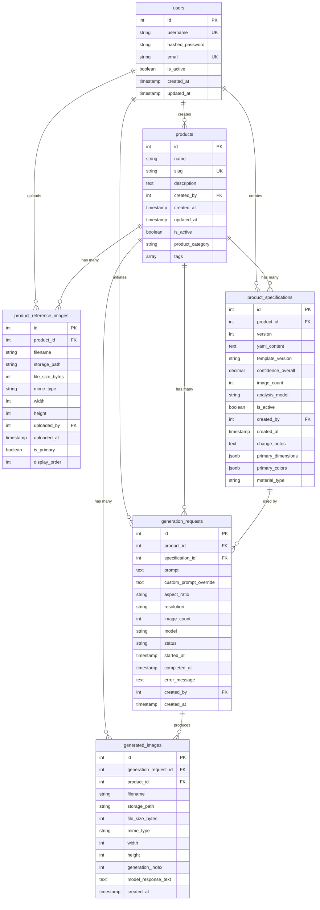

---

## Table Details

### 1. users

User authentication and authorization.

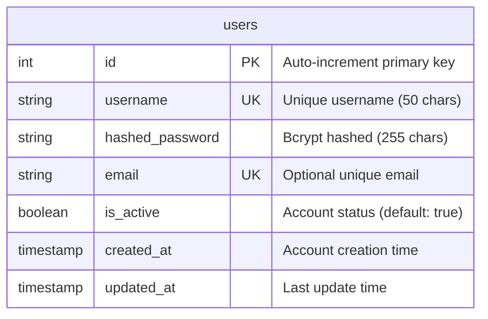

**Indexes**:
- Primary Key: `id`
- Unique: `username`, `email`

**Security**:
- Passwords hashed with bcrypt
- JWT token-based authentication
- Can be extended with roles/permissions

**Default User**:
- Username: `admin`
- Password: `admin123` (hashed)

---

### 2. products

Core product entities (analogous to "brands" in VML system).

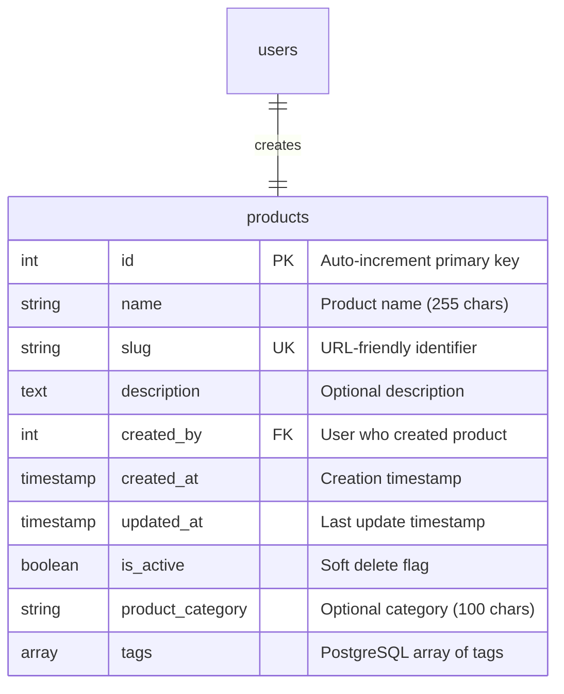

**Indexes**:
- Primary Key: `id`
- Unique: `slug`
- Index: `created_by`

**Constraints**:
- Slug format: `^[a-z0-9_-]+$` (lowercase, numbers, underscores, hyphens only)

**Example**:
```sql
INSERT INTO products (name, slug, description, created_by, product_category, tags)
VALUES (
    'Stasher Half Gallon Bag',
    'stasher_half_gallon',
    'Reusable silicone storage bag',
    1,
    'Kitchen Storage',
    ARRAY['silicone', 'reusable', 'eco-friendly']
);
```

---

### 3. product_reference_images

Reference images uploaded for each product (analogous to "brand assets").

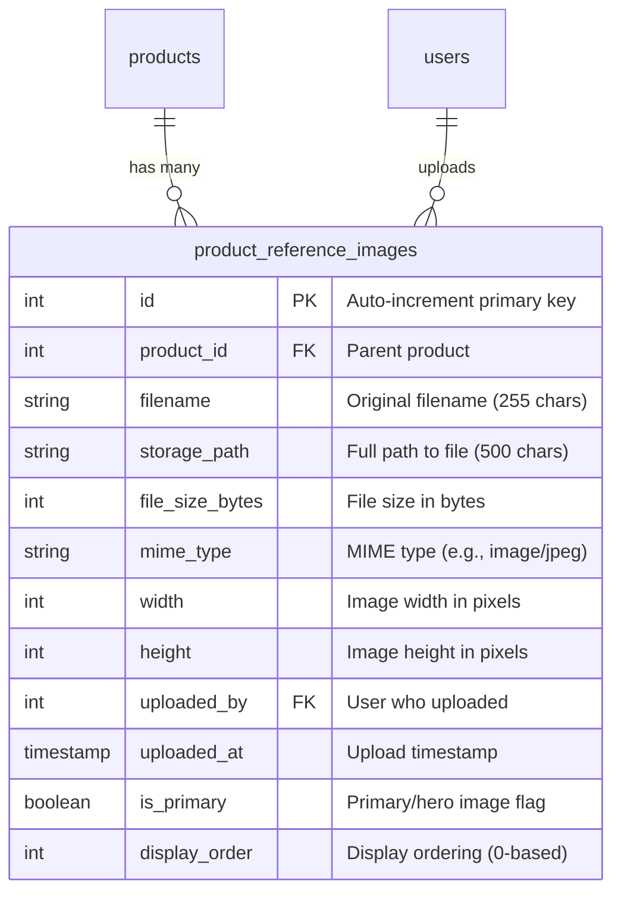

**Indexes**:
- Primary Key: `id`
- Index: `product_id`
- Composite Index: `(product_id, is_primary)`

**Constraints**:
- Only ONE primary image per product (PostgreSQL EXCLUDE constraint)
- Cascade delete when product is deleted

**Storage Path Example**:
```
local_storage/stasher_half_gallon/refs/original_1.jpg
```

---

### 4. product_specifications

YAML specifications generated from GPT Vision analysis with full version control.

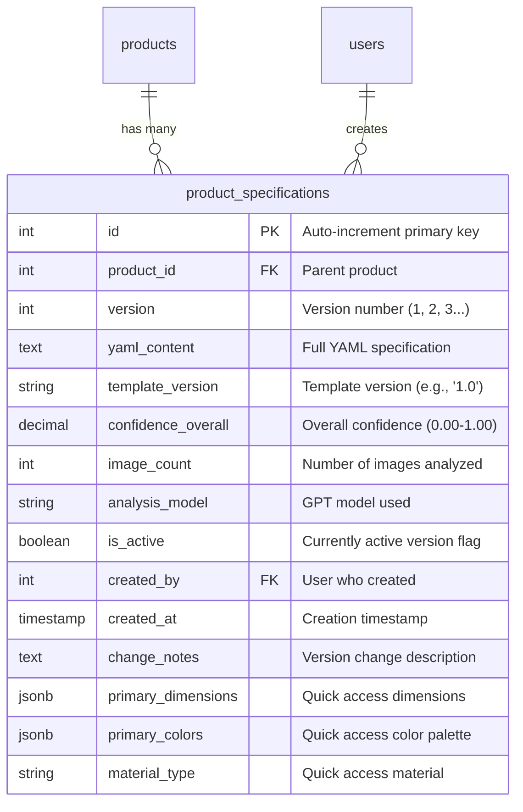

**Indexes**:
- Primary Key: `id`
- Index: `product_id`
- Composite Index: `(product_id, is_active)`
- Composite Index: `(product_id, version DESC)`

**Constraints**:
- Unique: `(product_id, version)`
- Only ONE active specification per product (PostgreSQL EXCLUDE constraint)

**Version Control Workflow**:
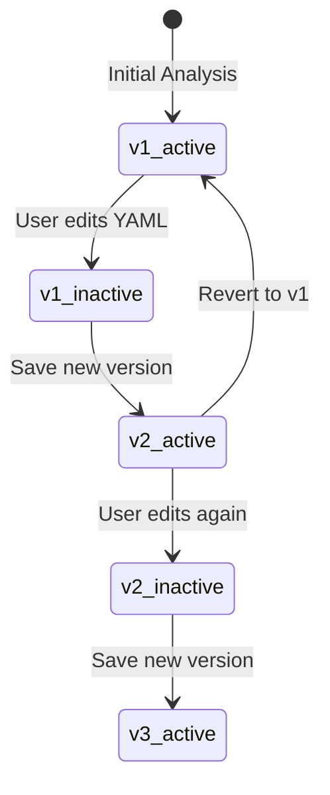

**JSONB Fields** (for fast queries without parsing YAML):
- `primary_dimensions`: `{"width": 215.9, "height": 260.35, "depth": 35.0, "unit": "mm"}`
- `primary_colors`: `[{"hex": "#CFE7EE", "name": "pale icy blue"}, {...}]`
- `material_type`: `"silicone"`

---

### 5. generation_requests

Image generation jobs with status tracking.

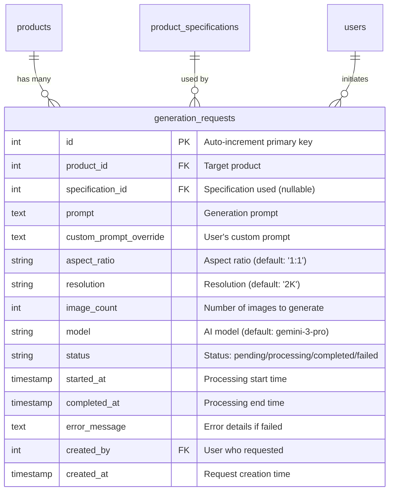

**Indexes**:
- Primary Key: `id`
- Index: `product_id`
- Index: `status`
- Index: `created_by`
- Index: `created_at DESC`

**Constraints**:
- Status CHECK: `IN ('pending', 'processing', 'completed', 'failed')`

**Status Lifecycle**:
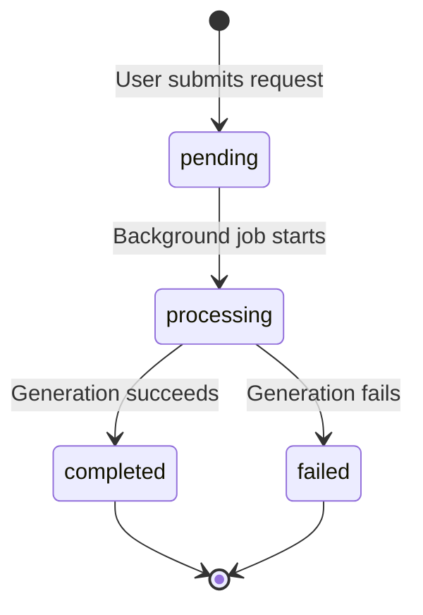

---

### 6. generated_images

Output images from generation requests.

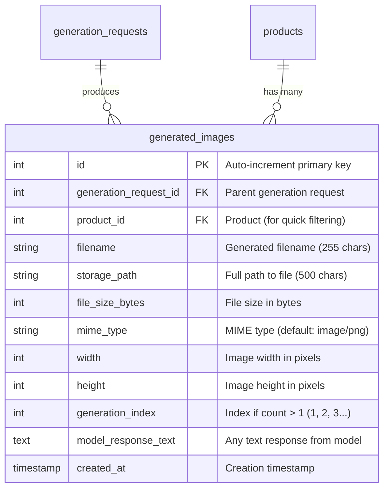

**Indexes**:
- Primary Key: `id`
- Index: `generation_request_id`
- Index: `product_id`
- Index: `created_at DESC`

**Constraints**:
- Unique: `(generation_request_id, generation_index)`
- Cascade delete when generation_request is deleted

**Storage Path Example**:
```
local_storage/stasher_half_gallon/generated/2026/02/20260205_143022_abc123.png
```

---

## Database Workflows

### Workflow 1: Product Creation & Analysis

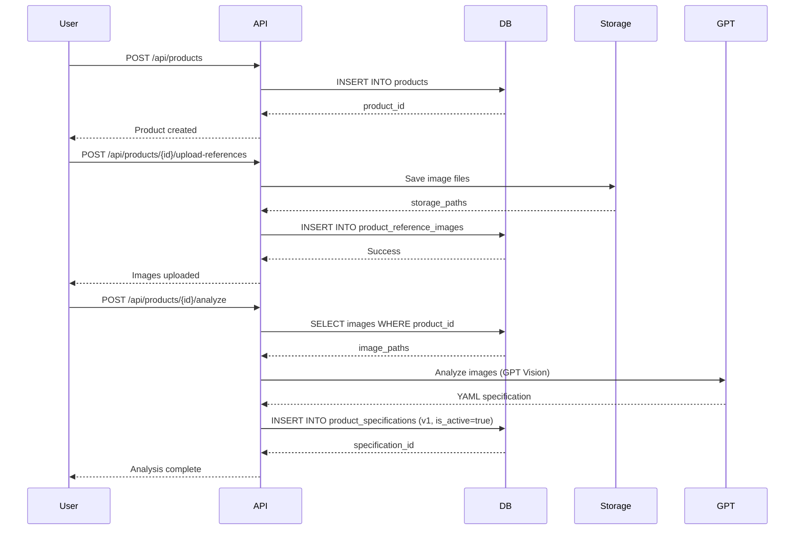

### Workflow 2: Specification Versioning

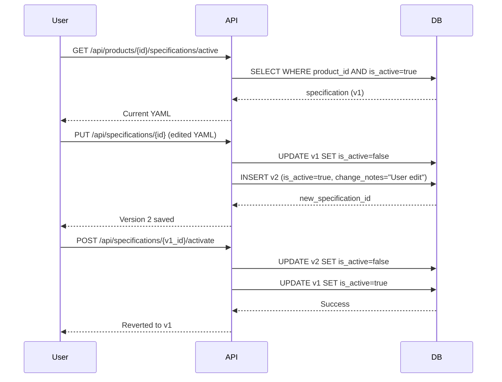

### Workflow 3: Image Generation

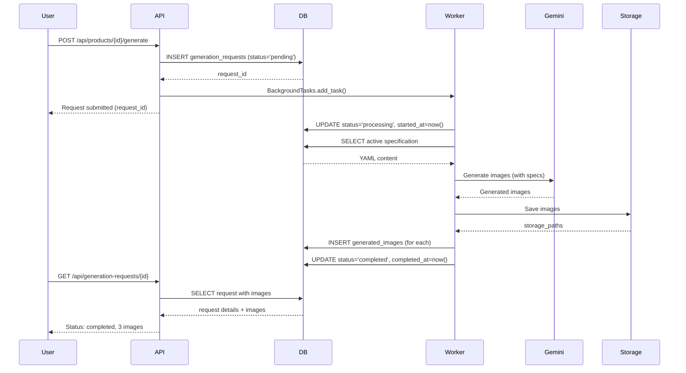

---

## Storage Architecture

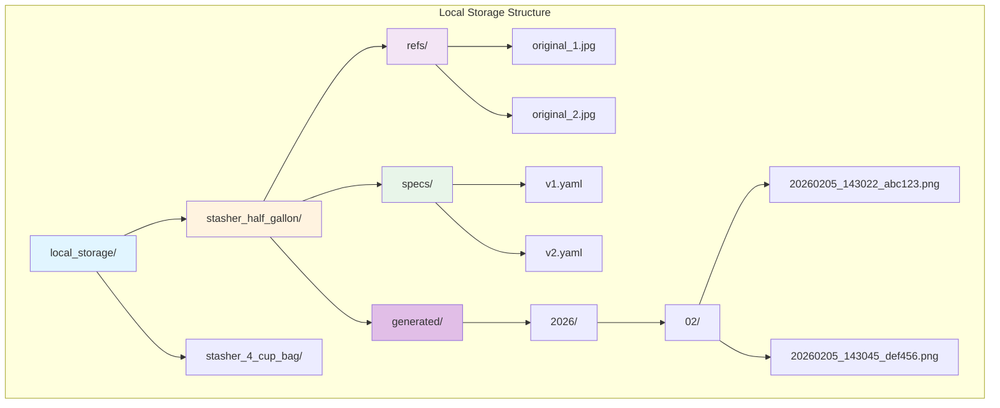

**Path Templates**:
- Reference images: `local_storage/{product_slug}/refs/{filename}`
- Specifications: `local_storage/{product_slug}/specs/v{version}.yaml`
- Generated images: `local_storage/{product_slug}/generated/{year}/{month}/{timestamp}_{hash}.png`

---

## Query Examples

### Get Product with All Related Data

```sql
SELECT 
    p.id,
    p.name,
    p.slug,
    COUNT(DISTINCT pri.id) as reference_count,
    COUNT(DISTINCT ps.id) as spec_version_count,
    COUNT(DISTINCT gr.id) as generation_count,
    COUNT(DISTINCT gi.id) as generated_image_count
FROM products p
LEFT JOIN product_reference_images pri ON p.id = pri.product_id
LEFT JOIN product_specifications ps ON p.id = ps.product_id
LEFT JOIN generation_requests gr ON p.id = gr.product_id
LEFT JOIN generated_images gi ON p.id = gi.product_id
WHERE p.is_active = true
GROUP BY p.id;
```

### Get Active Specification with Quick Access Fields

```sql
SELECT 
    ps.id,
    ps.version,
    ps.yaml_content,
    ps.primary_dimensions->>'width' as width,
    ps.primary_dimensions->>'height' as height,
    ps.primary_dimensions->>'unit' as unit,
    ps.primary_colors,
    ps.material_type,
    ps.confidence_overall,
    ps.created_at
FROM product_specifications ps
WHERE ps.product_id = $1
  AND ps.is_active = true;
```

### Get Recent Generations with Images

```sql
SELECT 
    gr.id,
    gr.prompt,
    gr.status,
    gr.created_at,
    gr.completed_at,
    COUNT(gi.id) as image_count,
    ARRAY_AGG(gi.storage_path) as image_paths
FROM generation_requests gr
LEFT JOIN generated_images gi ON gr.id = gi.generation_request_id
WHERE gr.product_id = $1
GROUP BY gr.id
ORDER BY gr.created_at DESC
LIMIT 10;
```

### Search Products by Color (JSONB Query)

```sql
SELECT DISTINCT
    p.id,
    p.name,
    p.slug,
    ps.primary_colors
FROM products p
JOIN product_specifications ps ON p.id = ps.product_id
WHERE ps.is_active = true
  AND ps.primary_colors @> '[{"hex": "#CFE7EE"}]'::jsonb;
```

---

## Migration History

### Initial Migration: `cf5f6be2f015_initial_schema_with_users_products_.py`

**Created**: 2026-01-27  
**Status**: Applied

**Tables Created**:
1. `users`
2. `products`
3. `product_reference_images`
4. `product_specifications`
5. `generation_requests`
6. `generated_images`

**Features**:
- Full foreign key relationships
- Check constraints for data validation
- Composite indexes for performance
- PostgreSQL-specific features (ARRAY, JSONB, EXCLUDE constraints)
- Cascade delete for dependent records

---

## Performance Considerations

### Indexes

All critical query paths have appropriate indexes:
- Primary keys (auto-indexed)
- Foreign keys
- Unique constraints
- Composite indexes for common query patterns
- Timestamp indexes for sorting

### JSONB Usage

JSONB fields provide fast queries without parsing YAML:
```sql
-- Fast dimension lookup
WHERE ps.primary_dimensions->>'width' > '200'

-- Fast color search
WHERE ps.primary_colors @> '[{"hex": "#CFE7EE"}]'::jsonb
```

### Soft Deletes

Products use `is_active` flag instead of hard deletes to:
- Preserve historical data
- Maintain referential integrity
- Enable undo/restore functionality

---

## Security Features

### Password Security
- Bcrypt hashing with salt
- No plain text passwords stored
- Configurable hash rounds

### JWT Authentication
- Stateless authentication
- Configurable expiration
- Secure token generation

### SQL Injection Prevention
- Parameterized queries via SQLAlchemy ORM
- Input validation via Pydantic schemas

### Access Control
- User ownership tracking (`created_by` fields)
- Can be extended with role-based permissions

---

## Backup & Recovery

### Recommended Backup Strategy

```bash
# Daily automated backup
pg_dump -U pd_user -h localhost -p 5433 product_describer_db \
  -F c -b -v -f backup_$(date +%Y%m%d).dump

# Point-in-time recovery
psql -U pd_user -h localhost -p 5433 product_describer_db \
  < backup_20260205.dump
```

### Data Retention

- **Users**: Permanent
- **Products**: Soft delete (permanent storage)
- **Specifications**: All versions preserved
- **Generations**: Permanent (consider archival strategy for old images)
- **Images**: Consider moving old generated images to cold storage

---

## Future Enhancements

### Potential Schema Extensions

1. **Role-Based Access Control**
   ```sql
   CREATE TABLE roles (
       id SERIAL PRIMARY KEY,
       name VARCHAR(50) UNIQUE NOT NULL
   );
   
   CREATE TABLE user_roles (
       user_id INTEGER REFERENCES users(id),
       role_id INTEGER REFERENCES roles(id),
       PRIMARY KEY (user_id, role_id)
   );
   ```

2. **Product Collections/Categories**
   ```sql
   CREATE TABLE product_collections (
       id SERIAL PRIMARY KEY,
       name VARCHAR(255) NOT NULL,
       description TEXT
   );
   
   CREATE TABLE product_collection_memberships (
       product_id INTEGER REFERENCES products(id),
       collection_id INTEGER REFERENCES product_collections(id),
       PRIMARY KEY (product_id, collection_id)
   );
   ```

3. **Image Favorites/Ratings**
   ```sql
   CREATE TABLE image_favorites (
       user_id INTEGER REFERENCES users(id),
       image_id INTEGER REFERENCES generated_images(id),
       rating INTEGER CHECK (rating BETWEEN 1 AND 5),
       created_at TIMESTAMP DEFAULT CURRENT_TIMESTAMP,
       PRIMARY KEY (user_id, image_id)
   );
   ```

4. **Audit Trail**
   ```sql
   CREATE TABLE audit_log (
       id SERIAL PRIMARY KEY,
       table_name VARCHAR(100) NOT NULL,
       record_id INTEGER NOT NULL,
       action VARCHAR(20) NOT NULL, -- INSERT, UPDATE, DELETE
       old_data JSONB,
       new_data JSONB,
       user_id INTEGER REFERENCES users(id),
       timestamp TIMESTAMP DEFAULT CURRENT_TIMESTAMP
   );
   ```

---

## Related Documentation

- [BACKEND_DATABASE_PLAN.md](./BACKEND_DATABASE_PLAN.md) - Implementation plan and checklist
- [ARCHITECTURE.md](./ARCHITECTURE.md) - Overall system architecture
- [DEVELOPER.md](./DEVELOPER.md) - Developer guide with API documentation
- [README.md](../README.md) - Project overview and setup instructions

---

## Maintenance Commands

### View Schema Information

```sql
-- List all tables
SELECT tablename FROM pg_tables WHERE schemaname = 'public';

-- View table structure
\d+ products

-- Check indexes
SELECT * FROM pg_indexes WHERE schemaname = 'public';

-- View foreign keys
SELECT * FROM information_schema.table_constraints 
WHERE constraint_type = 'FOREIGN KEY';
```

### Database Statistics

```sql
-- Table sizes
SELECT 
    schemaname,
    tablename,
    pg_size_pretty(pg_total_relation_size(schemaname||'.'||tablename)) as size
FROM pg_tables
WHERE schemaname = 'public'
ORDER BY pg_total_relation_size(schemaname||'.'||tablename) DESC;

-- Row counts
SELECT 
    schemaname,
    tablename,
    n_tup_ins - n_tup_del as row_count
FROM pg_stat_user_tables
WHERE schemaname = 'public';
```

---

**Last Updated**: February 5, 2026  
**Schema Version**: 1.0  
**Migration**: cf5f6be2f015
