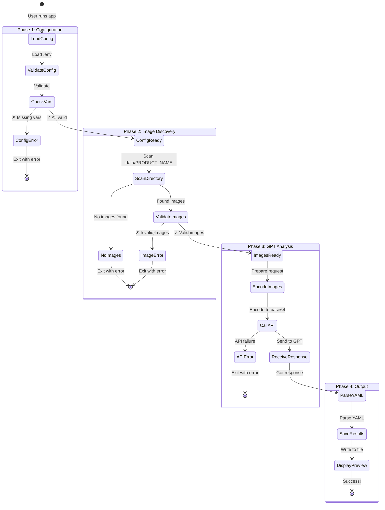

# Execution Plan

## Quick Start Guide

### Prerequisites
1. Python 3.9 or higher installed
2. Poetry installed ([installation guide](https://python-poetry.org/docs/#installation))
3. OpenAI API key with access to GPT Vision models

### Step-by-Step Execution

#### 1. Initial Setup (One-time)

```bash
# Navigate to project directory
cd /Users/Brian.Douglas/GXM_DEV/2026-01-23_product_describer

# Install dependencies
poetry install

# Create your environment configuration
cp .env.example .env

# Edit .env file with your settings
# - Set PRODUCT_NAME to your product identifier
# - Set OPENAI_API_KEY to your OpenAI API key
nano .env  # or use your preferred editor
```

#### 2. Prepare Product Data

```bash
# Create directory for your product images
# Example: If PRODUCT_NAME=sneaker_nike_air
mkdir -p data/sneaker_nike_air

# Add your product images to the directory
# Supported formats: .jpg, .jpeg, .png, .gif, .webp
cp /path/to/images/*.jpg data/sneaker_nike_air/

# Verify images are in place
ls -lh data/sneaker_nike_air/
```

#### 3. Run Analysis

```bash
# Activate Poetry shell (optional but recommended)
poetry shell

# Run the product describer
python -m product_describer.main

# Or run without activating shell
poetry run python -m product_describer.main
```

#### 4. Review Results

```bash
# Check the output directory
ls -lh temp/<PRODUCT_NAME>/

# View the generated description
cat temp/<PRODUCT_NAME>/description.yaml

# Or open in editor
code temp/<PRODUCT_NAME>/description.yaml
```

## Execution Workflow



## Common Execution Scenarios

### Scenario 1: Analyzing a New Product

```bash
# 1. Set product name in .env
echo "PRODUCT_NAME=laptop_dell_xps" >> .env

# 2. Create data directory and add images
mkdir -p data/laptop_dell_xps
cp ~/Downloads/laptop_*.jpg data/laptop_dell_xps/

# 3. Run analysis
poetry run python -m product_describer.main

# 4. Results will be in:
# temp/laptop_dell_xps/description.yaml
```

### Scenario 2: Re-analyzing Same Product

```bash
# Just run the analysis again
# Same configuration, potentially updated images
poetry run python -m product_describer.main

# Output file will be overwritten
```

### Scenario 3: Analyzing Multiple Products

```bash
# Product 1
echo "PRODUCT_NAME=product_a" > .env
echo "OPENAI_API_KEY=your_key" >> .env
poetry run python -m product_describer.main

# Product 2
echo "PRODUCT_NAME=product_b" > .env
echo "OPENAI_API_KEY=your_key" >> .env
poetry run python -m product_describer.main

# Each creates its own output:
# temp/product_a/description.yaml
# temp/product_b/description.yaml
```

### Scenario 4: Using Different GPT Model

```bash
# Add to .env
echo "GPT_MODEL=gpt-4-turbo" >> .env

# Run analysis
poetry run python -m product_describer.main
```

## Error Handling & Troubleshooting

### Common Errors

#### 1. Missing Environment Variables
```
❌ Configuration Error: PRODUCT_NAME environment variable is required

Solution:
- Check .env file exists
- Verify PRODUCT_NAME is set
- Ensure no typos in variable name
```

#### 2. No Images Found
```
❌ No images found in data/<PRODUCT_NAME>

Solution:
- Verify data directory exists: ls data/
- Check product name matches: echo $PRODUCT_NAME
- Ensure images have correct extensions (.jpg, .png, etc.)
```

#### 3. API Authentication Error
```
❌ OpenAI API Error: Invalid API key

Solution:
- Verify OPENAI_API_KEY in .env
- Check key is active at platform.openai.com
- Ensure no extra spaces or quotes
```

#### 4. Invalid Images
```
⚠ Errors found:
  - Invalid image corrupted.jpg: cannot identify image file

Solution:
- Remove or replace corrupted images
- Verify image files can be opened
- Check file format is supported
```

## Performance Expectations

### Processing Times (Approximate)

| Images | Size      | Time    | API Cost |
|--------|-----------|---------|----------|
| 1-3    | < 5MB ea  | 10-20s  | $0.01-0.05 |
| 4-6    | < 5MB ea  | 20-40s  | $0.05-0.10 |
| 7-10   | < 5MB ea  | 40-60s  | $0.10-0.20 |

*Times and costs are estimates and vary based on image complexity, network, and API load*

### Optimization Tips

1. **Image Size**: Resize large images before processing
2. **Image Count**: 3-6 images typically sufficient for analysis
3. **Network**: Ensure stable internet connection
4. **API Limits**: Be aware of rate limits on OpenAI account

## Testing Execution

### Run Tests

```bash
# Run all tests
poetry run pytest

# Run with coverage
poetry run pytest --cov=product_describer

# Run specific test file
poetry run pytest tests/test_main.py

# Run with verbose output
poetry run pytest -v
```

### Code Quality Checks

```bash
# Format code
poetry run black src/ tests/

# Check linting
poetry run flake8 src/ tests/

# Type checking
poetry run mypy src/
```

## Production Deployment Considerations

### Environment Setup
- Use environment-specific .env files
- Store API keys in secure vaults (e.g., AWS Secrets Manager)
- Set up proper logging
- Configure error monitoring

### Scaling
- Consider async processing for multiple products
- Implement queue system for batch processing
- Add retry logic with exponential backoff
- Cache API responses when appropriate

### Monitoring
- Track API usage and costs
- Monitor processing times
- Alert on failures
- Log all errors with context

## Next Steps After Execution

1. **Review Output**: Examine description.yaml for accuracy
2. **Validate Data**: Ensure all expected facets are present
3. **Iterate**: Adjust images or prompts if needed
4. **Generate Images with Nano Banana Pro**: Use the YAML output to generate product images
5. **Integrate**: Use YAML output in downstream systems
6. **Archive**: Store results with product data

## Using Nano Banana Pro for Image Generation

After generating your technical YAML description, you can use Google's Nano Banana Pro (Gemini 3 Pro Image) to generate product images based on the specifications.

### Setup for Image Generation

```bash
# Install Google Gen AI SDK
poetry add google-genai

# Add Gemini API key to .env
echo "GEMINI_API_KEY=your_gemini_api_key_here" >> .env
```

### Generate Images from YAML

The project includes a generation test script that:
1. Loads your product YAML specifications
2. Sends a reference image
3. Uses a custom prompt to guide generation
4. Generates a new product image based on technical specs

```bash
# Run the image generation test
poetry run python -m product_describer.generate_test

# Or specify a different product
PRODUCT_NAME=your_product poetry run python -m product_describer.generate_test
```

### What Gets Sent to Nano Banana Pro

The generation includes:
- **Reference Image**: One of your original product images
- **Technical YAML**: Complete specifications (geometry, colors, materials, optical properties)
- **Custom Prompt**: Your instructions for image generation
- **Model**: `gemini-3-pro-image-preview` (Nano Banana Pro)

### Output

Generated images are saved to:
```
temp/<PRODUCT_NAME>/test_images/generated_<timestamp>.png
```

### Features

- **High Fidelity**: Uses technical specs for accurate reconstruction
- **4K Resolution**: Can generate up to 4K images (specify in config)
- **Multiple Reference Images**: Supports up to 14 reference images
- **Aspect Ratio Control**: Specify custom aspect ratios (16:9, 1:1, etc.)
- **Advanced Reasoning**: Model uses "Thinking" process for complex instructions

### Example Workflow

```bash
# 1. Analyze product images
PRODUCT_NAME=stasher_bag poetry run python -m product_describer.main

# 2. Review the generated YAML
cat temp/stasher_bag/description.yaml

# 3. Generate new images from specs
poetry run python -m product_describer.generate_test

# 4. View the generated image
open temp/stasher_bag/test_images/generated_*.png
```
