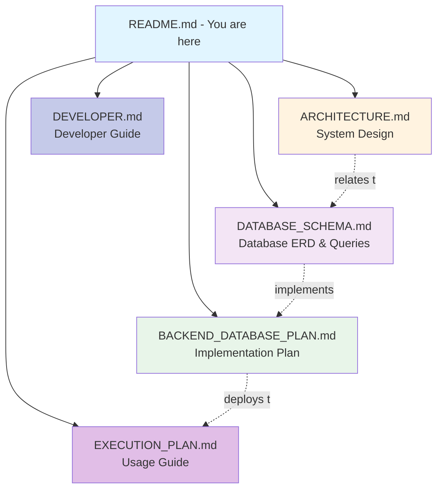

# Product Describer Documentation

Welcome to the Product Describer documentation. This directory contains comprehensive documentation for developers and users.

## Documentation Index

### 📐 [Architecture Documentation](ARCHITECTURE.md)
Detailed system architecture, component design, and data flow diagrams.

**Contents**:
- System overview and architecture diagram
- Component responsibilities
- Data flow and processing pipeline
- Technology stack
- Security and performance considerations
- Future enhancements

**Read this if you want to**:
- Understand how the system works
- Learn about component interactions
- Review design decisions
- Plan extensions or modifications

---

### �️ [Database Schema Documentation](DATABASE_SCHEMA.md)
Complete database schema with ERD diagrams, relationships, and query examples.

**Contents**:
- Entity Relationship Diagrams (Mermaid)
- Table structures and constraints
- Workflow sequence diagrams
- Storage architecture
- Query examples and performance tips
- Migration history

**Read this if you want to**:
- Understand the database design
- Learn about data relationships
- Write efficient queries
- Plan schema extensions
- Troubleshoot data issues

---

### 🔧 [Backend Database Plan](BACKEND_DATABASE_PLAN.md)
Implementation plan and checklist for the backend API and database.

**Contents**:
- Database schema design (SQL)
- API endpoint specifications
- Implementation checklist
- Integration strategy
- Deployment configuration

**Read this if you want to**:
- Track backend implementation progress
- Understand API design decisions
- Review implementation requirements
- Plan backend deployment

---

### �🚀 [Execution Plan](EXECUTION_PLAN.md)
Step-by-step guide for running the application and handling common scenarios.

**Contents**:
- Quick start guide
- Detailed execution workflow
- Common execution scenarios
- Error handling and troubleshooting
- Performance expectations
- Production deployment considerations

**Read this if you want to**:
- Set up and run the application
- Understand the execution process
- Troubleshoot common issues
- Learn about different usage scenarios

---

### 💻 [Developer Documentation](DEVELOPER.md)
Complete guide for developers contributing to or extending the project.

**Contents**:
- Development environment setup
- Project structure
- Module API reference
- Development workflow
- Testing guidelines
- Contributing guidelines
- Code style and conventions
- Debugging tips

**Read this if you want to**:
- Contribute to the project
- Understand the codebase
- Add new features
- Write tests
- Follow coding standards

---

## Quick Links

### For Users
- **Getting Started**: Start with [Execution Plan](EXECUTION_PLAN.md#quick-start-guide)
- **Troubleshooting**: See [Error Handling](EXECUTION_PLAN.md#error-handling--troubleshooting)
- **Configuration**: Check [Architecture - Configuration](ARCHITECTURE.md#2-configuration-configpy)

### For Developers
- **Setup**: Begin with [Developer Setup](DEVELOPER.md#development-setup)
- **Architecture**: Review [Architecture Overview](ARCHITECTURE.md#system-overview)
- **Database**: Check [Database Schema](DATABASE_SCHEMA.md)
- **API Reference**: See [Module Documentation](DEVELOPER.md#module-documentation)
- **Testing**: Read [Testing Guide](DEVELOPER.md#testing)

### For Maintainers
- **Architecture**: [System Design](ARCHITECTURE.md)
- **Database**: [Schema Documentation](DATABASE_SCHEMA.md)
- **Backend Plan**: [Implementation Checklist](BACKEND_DATABASE_PLAN.md)
- **Contributing**: [Contribution Guidelines](DEVELOPER.md#contributing)
- **Deployment**: [Production Considerations](EXECUTION_PLAN.md#production-deployment-considerations)

## Document Relationships

## Documentation Standards

All documentation follows these principles:

- **Clear**: Easy to understand for target audience
- **Complete**: Covers all necessary information
- **Current**: Kept up-to-date with code changes
- **Concise**: No unnecessary verbosity
- **Practical**: Includes examples and real scenarios

## Contributing to Documentation

Found an error or want to improve the docs?

1. Identify which document needs updating
2. Make your changes following the existing style
3. Test any code examples provided
4. Submit a pull request with clear description

## Version History

- **v0.1.0** (January 23, 2026): Initial documentation created
  - Architecture documentation
  - Execution plan
  - Developer guide

## Need Help?

- Check the relevant documentation section first
- Review code examples in the docs
- Look at test files for usage examples
- Open an issue on GitHub for questions

---

**Last Updated**: January 23, 2026
